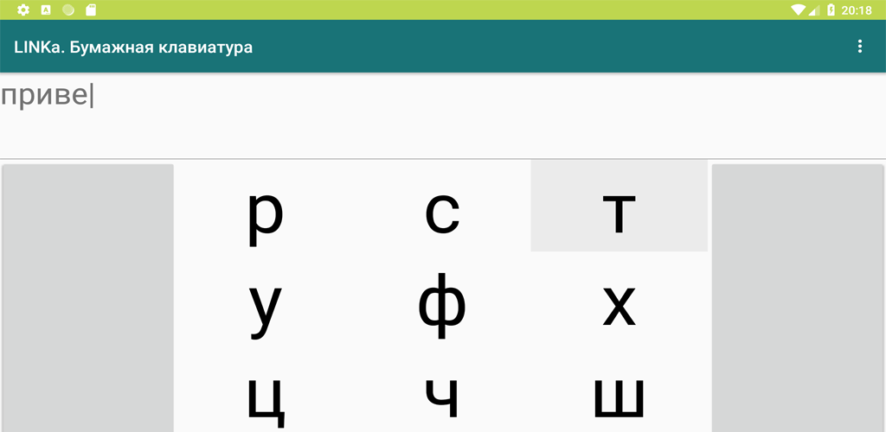

# LINKa. Paper Board

Android app and input method for composing text from a paged symbol grid. The app can speak composed text with Android TextToSpeech and can also be enabled as a system keyboard.



## Project

- Single Android application module: `:app`.
- Package and namespace: `su.linka.linkapaperboard`.
- Launcher UI entrypoint: `MainActivity`.
- Keyboard service entrypoint: `PaperboardIME`.
- Shared grid UI layout: `app/src/main/res/layout/keys.xml`.

## Requirements

- JDK 17.
- Android SDK with `compileSdk 36` installed.
- Use the checked-in Gradle wrapper: `./gradlew`.

## Build

```bash
./gradlew assembleDebug
```

Release bundle, matching CI:

```bash
./gradlew clean bundleRelease
```

Release signing is optional locally. To produce a signed release artifact, set:

```bash
ANDROID_KEYSTORE=/path/to/keystore
ANDROID_KEYSTORE_PASSWORD=...
ANDROID_KEY_ALIAS=...
ANDROID_KEY_PASSWORD=...
```

## Test And Lint

Run all local JVM unit tests:

```bash
./gradlew testDebugUnitTest
```

Run one test class:

```bash
./gradlew testDebugUnitTest --tests su.linka.linkapaperboard.CookieTest
```

Run debug lint:

```bash
./gradlew lintDebug
```

Run instrumented tests only with a connected device or emulator:

```bash
./gradlew connectedDebugAndroidTest
```

## Notes

- The selectable alphabet is localized via `@string/alphabet`; English and Russian alphabets intentionally differ.
- The space key is stored internally as `␣` and converted to a real space when a grid item is clicked.
- `Cookie` stores app preferences in SharedPreferences; tests that touch it should reset state with `Cookie.resetForTests(context)`.
